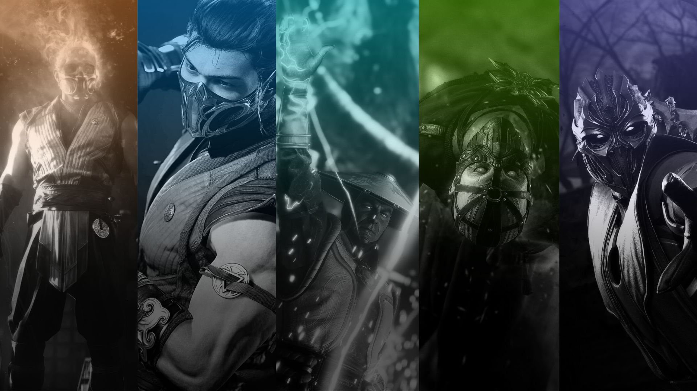

# MK Verse - Portal Mortal Kombat



## Sobre o Projeto

Site temático sobre os personagens icônicos de Mortal Kombat, desenvolvido com tecnologias front-end modernas. Este projeto demonstra habilidades em desenvolvimento web, animações CSS, manipulação do DOM, e design responsivo, tudo com uma estética sombria que captura a essência do universo de Mortal Kombat.

## Tecnologias Utilizadas

- **HTML5**: Estruturação semântica do conteúdo
- **CSS3**: Estilização avançada com:
  - Gradientes dinâmicos
  - Flexbox e Grid Layout
  - Animações e transições fluidas
  - Efeitos de parallax
  - Design totalmente responsivo
- **JavaScript**: Funcionalidades dinâmicas como:
  - Navegação interativa com scrolling suave
  - Toggle de informações com animações
  - Animações de scroll com IntersectionObserver
  - Otimização de desempenho com requestAnimationFrame
  - Efeito parallax na seção hero
  - Lazy loading de imagens
- **Google Fonts**: Tipografia Montserrat

## Funcionalidades

- **Design Responsivo**: Experiência perfeita em qualquer dispositivo
- **Navegação Suave**: Rolagem com animações entre seções
- **Botões Interativos**: Revelação de curiosidades com animações
- **Efeito Parallax**: Efeito de profundidade na imagem de capa
- **Cards de Personagens**: Interface visualmente impactante para cada lutador
- **Animations on Scroll**: Elementos animados conforme o usuário rola a página
- **Gradientes Temáticos**: Cores personalizadas para cada personagem

## Personagens Destacados

O site apresenta perfis detalhados dos seguintes personagens:
- Scorpion
- Sub-Zero
- Raiden
- Ermac
- Noob Saibot

## Responsividade

O layout foi desenvolvido para garantir que o site funcione perfeitamente em:
- Smartphones
- Tablets
- Desktops
- Telas maiores

## Objetivos Técnicos

Este projeto foi desenvolvido com foco em:
- **Performance**: Otimização de imagens e código
- **Acessibilidade**: Seguindo boas práticas para inclusão
- **Animações Fluidas**: Transições suaves e efeitos visuais otimizados
- **UX/UI**: Interface sombria e imersiva que remete ao universo de Mortal Kombat

## Otimizações Técnicas

- Uso de IntersectionObserver para carregar animações sob demanda
- Implementação de lazy loading para imagens
- Otimização de scroll com requestAnimationFrame
- Meta tags para melhorar a experiência mobile
- Preload de recursos críticos

## Como Executar o Projeto

1. Clone este repositório
   ```
   git clone https://github.com/mxndex7/mk-verse.git
   ```
2. Abra o arquivo `index.html` em seu navegador
   
## Implementações Futuras

- [ ] Modo claro/escuro
- [ ] Mais personagens do universo MK
- [ ] Galeria de fatalities

## Desenvolvedor

Desenvolvido por Guilherme Mendes - Portfólio Front-end.

---

⭐ Se gostou deste projeto, não se esqueça de dar uma estrela no repositório!
